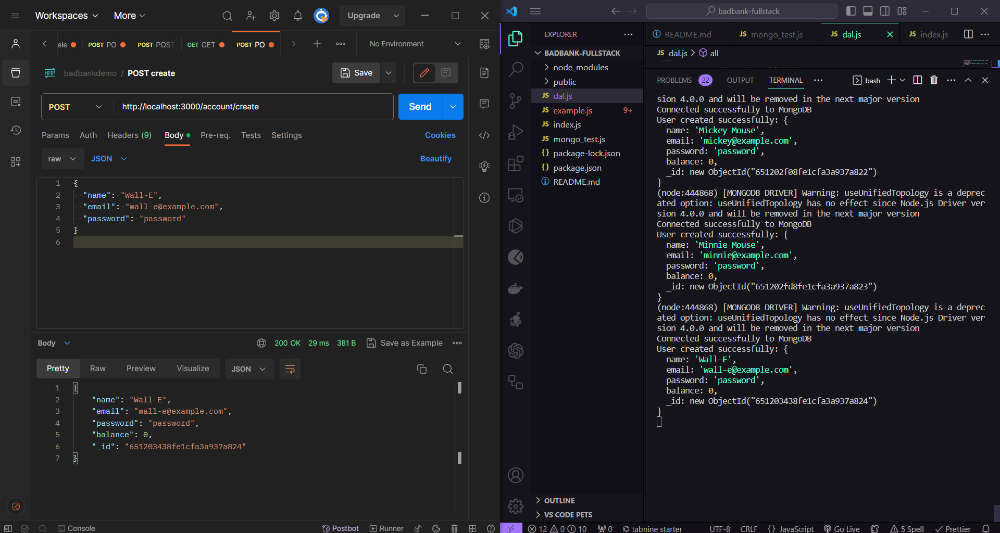

# Bad Bank Demo - Full Stack Application

Bad Bank is a full-stack banking application that allows users to create accounts, deposit and withdraw funds, and check their account balance. This project was created for the MITxPro Fullstack Developer MERN stack project.

## Dependencies

### Frontend:

- React

### Backend:

- Node.js `npm init`
- Express.js `npm install express`
- CORS `npm install cors`
- MongoDB `npm install mongodb`

## Postman Screenshot



## Installation Guidelines:

### Frontend:

1. Clone this repository to your local machine: `git clone`

2. Navigate to the project directory: `cd bad-bank-demo-frontend`

3. Install dependencies: `npm install`

4. Start the frontend server: `npm start`

### Backend:

1. Navigate to the project directory: `cd bad-bank-demo-backend`

2. Install dependencies: `npm install`

3. Run the backend server: `node index.js`

### MongoDB Database Setup:

1. Ensure you have Docker installed.

2. Run a MongoDB Docker container: `docker run -p 27017:27017 --name badbankdemo -d mongo`

3. Verify that the Docker container is running: `docker ps`

4. If the Docker container is not running: `docker start badbankdemo`

## Features

- User account creation
- Deposit and Withdrawal of funds
- Account balance checking
- All Data displayed

## Run the server:

```
node index.js

```

## MongoDB Database Setup

```
docker run -p 27017:27017 --name badbankdemo -d mongo

```

- Check that the Docker container is running: `docker ps`
- If the Docker container is not running: `docker start badbankdemo`

## License Info

[MIT](https://choosealicense.com/licenses/mit/)  
_Copyright (c) 2023 Jessica Cousins_

Permission is hereby granted, free of charge, to any person obtaining a copy
of this software and associated documentation files (the "Software"), to deal
in the Software without restriction, including without limitation the rights
to use, copy, modify, merge, publish, distribute, sublicense, and/or sell
copies of the Software, and to permit persons to whom the Software is
furnished to do so, subject to the following conditions:
The above copyright notice and this permission notice shall be included in all
copies or substantial portions of the Software.
THE SOFTWARE IS PROVIDED "AS IS", WITHOUT WARRANTY OF ANY KIND, EXPRESS OR
IMPLIED, INCLUDING BUT NOT LIMITED TO THE WARRANTIES OF MERCHANTABILITY,
FITNESS FOR A PARTICULAR PURPOSE AND NONINFRINGEMENT. IN NO EVENT SHALL THE
AUTHORS OR COPYRIGHT HOLDERS BE LIABLE FOR ANY CLAIM, DAMAGES OR OTHER
LIABILITY, WHETHER IN AN ACTION OF CONTRACT, TORT OR OTHERWISE, ARISING FROM,
OUT OF OR IN CONNECTION WITH THE SOFTWARE OR THE USE OR OTHER DEALINGS IN THE
SOFTWARE.

## Contributing

Contributions to this project are welcome. If you find any issues or have suggestions for improvements, please open an issue or submit a pull request.
